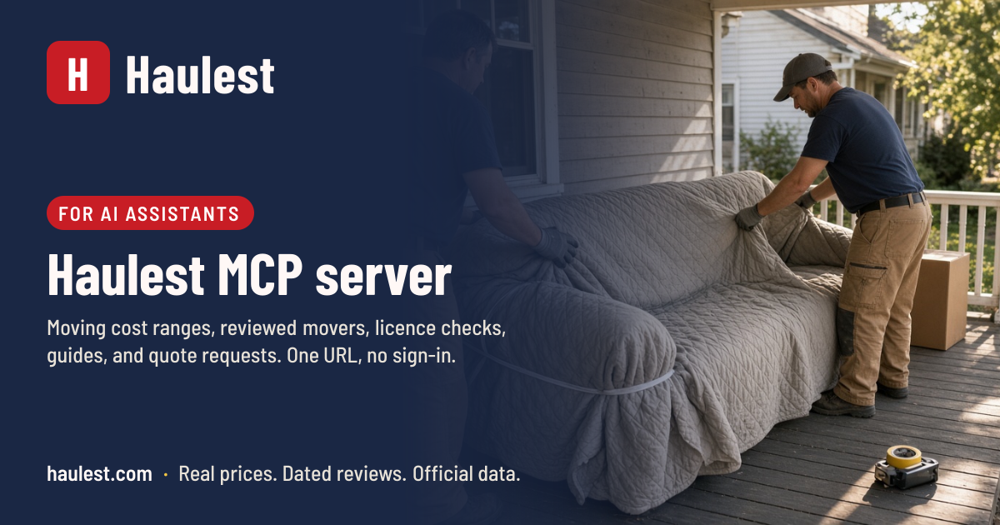

<p align="center">
  <a href="https://haulest.com/developers/mcp"></a>
</p>

<h1 align="center"> Haulest MCP server</h1>

<p align="center">
  <a href="https://haulest.com/mcp"></a>
  <a href="https://modelcontextprotocol.io"></a>
  
  <a href="LICENSE"></a>
</p>

**Endpoint:** `https://haulest.com/mcp`  ·  **Docs:** https://haulest.com/developers/mcp  ·  **Support:** info@haulest.com

[Haulest](https://haulest.com) is a consumer moving research and quote site for the United States, Canada, and the United Kingdom, run by Panaweb LLC. This server gives any Model Context Protocol client the same research the website publishes: cost ranges, reviewed movers, official licence records, guides, checklists, and a way to request written quotes from licensed movers.

Haulest is not a carrier. It does not operate trucks, a cost range is a planning number and not a bid, and a quote conversation is not a booking.

## Connect in one step

| Client | How |
| --- | --- |
| **Claude** (web, desktop, mobile) | Settings → Connectors → *Add custom connector* → paste `https://haulest.com/mcp` |
| **Claude Code** | `claude mcp add --transport http haulest https://haulest.com/mcp` |
| **ChatGPT** | Settings → Apps & Connectors → Advanced → Developer mode → *Create* → paste the URL, authentication *None* |
| **Cursor, VS Code, Windsurf, Zed** | add the snippet below to your `mcp.json` |
| **stdio-only clients** | `npx -y haulest-mcp` (the [bridge](bridge/) in this repo) or `npx -y mcp-remote https://haulest.com/mcp` |

```json
{
  "mcpServers": {
    "haulest": { "type": "http", "url": "https://haulest.com/mcp" }
  }
}
```

Step-by-step for each client: [docs/connecting.md](docs/connecting.md).

## Try it

- "What would it cost to move a 2-bedroom from Austin to Denver, and who are the best-reviewed movers in Austin?"
- "Check USDOT 3391195 before I pay a deposit."
- "Give me the 8-week moving checklist and the guide on binding versus non-binding estimates."
- "Are there reviewed removal companies in Manchester, and how do I check one at Companies House?"
- "I have a quote from a low-rated mover. What should I ask them, and can you get me two more written quotes?"

## Tools

| Tool | What it does | Hints |
| --- | --- | --- |
| `estimate_moving_cost` | Research cost range (low, high, currency) from home size and distance: a band, a mileage, or two place names resolved against stored route data | read-only |
| `get_route_facts` | Driving miles and hours, cost ranges by home size, Census migration flow, and the page URL for a Haulest route | read-only |
| `find_movers` | Movers with dated, attributed reviews in a city, state, province, or country: average rating, review count, newest review, USDOT, profile URL | read-only |
| `get_mover_profile` | One company in depth: rating, three newest reviews, USDOT and MC with the live FMCSA authority and insurance summary, public phone, what reviewers paid, questions to ask | read-only, open-world |
| `check_mover_licence` | FMCSA census by USDOT, MC, or legal name (US); Companies House by name or number (UK); provincial guidance (Canada); always with the official record URL | read-only, open-world |
| `search_moving_guides` | Guides, calculators, and checklists on estimates, deposits, damage claims, consumer rights, packing, and timing | read-only |
| `get_moving_checklist` | A full checklist: 8-week, moving day, first night, change of address (US, CA, UK), 12-week international | read-only |
| `request_moving_quotes` | Files a quote request so licensed movers call and email with written estimates. Requires `consent: true`; repeats within a day are recognised, not duplicated | write, never destructive |

Every tool carries a title and explicit `readOnlyHint`, `destructiveHint`, `idempotentHint`, and `openWorldHint` values. Each answer is plain text for the model plus a structured object with the same facts and the haulest.com URL it came from. The server also exposes a `plan_my_move` prompt and two resources (the full cost dataset as JSON, and an About text).

Exact schemas as served: [docs/tools.json](docs/tools.json). Refresh with `node scripts/snapshot-tools.mjs`.

## Where the answers come from

- **Cost ranges** are research planning ranges compiled in September 2026 from published industry tables and public quotes, labelled as such on every answer. Method: https://haulest.com/methodology.
- **Ratings** are the mean of real, dated reviews on record. Haulest does not invent totals and does not rank companies by payment.
- **Licence facts** come from the FMCSA census and the live QCMobile authority feed, or Companies House, with the official URL to confirm on.

## What is in this repository

The server runs inside the haulest.com application, because it reads the same review corpus and official records the website does. This repository holds the public interface:

| Path | Purpose |
| --- | --- |
| [`bridge/`](bridge/) | The `haulest-mcp` npm package: a stdio bridge to the endpoint for clients that cannot speak Streamable HTTP |
| [`server.json`](server.json) | Entry for the official MCP Registry (`com.haulest/haulest`) |
| [`openai-plugin/`](openai-plugin/) | ChatGPT plugin package (`plugin.json`, `mcp.json`, icons), review test cases, and the submission walkthrough |
| [`claude-connector/`](claude-connector/) | Claude connectors directory submission notes |
| [`docs/`](docs/) | Connecting, directory listings, tool snapshot |

## Fair use, privacy, security

Anonymous callers have per-minute and per-day limits per network address; a 429 carries `Retry-After`. Quote requests are limited per hour and capped per day, and a repeat from the same phone or email within a day returns the existing reference. Partner keys with higher limits: info@haulest.com.

Each call is logged with the tool name, time, outcome, client product, and a salted short hash of the network address for 90 days. Arguments are not logged, and nothing the server returns contains tokens, session identifiers, or other people's contact details. Full text: [privacy policy](https://haulest.com/privacy), [terms](https://haulest.com/terms), [SECURITY.md](SECURITY.md).

## Issues and contact

Open an [issue](https://github.com/Panaweb-LLC/haulest-mcp/issues) for the bridge, the manifests, or a tool answer that looks wrong. For anything involving a person's quote request, email info@haulest.com or call +1 (866) 961-9682.

## License

MIT for the code in this repository. Haulest content and data served by the endpoint remain subject to https://haulest.com/terms.
